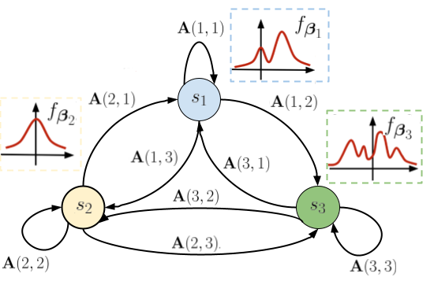

# FlowHMM: Flow-based continuous hidden Markov models

***Abstract***

Continuous hidden Markov models (HMMs) assume that observations 
are generated from a mixture of Gaussian densities, limiting their ability to model more complex distributions. 
In this work, we address this shortcoming and propose a~novel continuous HMM
that allows to learn general continuous observation densities without constraining them to follow a~Gaussian 
distribution or their mixtures.
To that end, we leverage deep flow-based architectures that model complex, non-Gaussian functions. Moreover, 
to simplify optimization and avoid costly expectation-maximization algorithm, we use the co-occurrence matrix
of discretized observations and consider the joint distribution of pairs of co-observed values.
Even though our model is trained on discretized observations, 
it represents a~continuous variant of HMM during inference, thanks 
to applying a~separate flow model for each hidden state. The experiments 
on synthetic and real datasets show that our method outperforms 
Gaussian baselines.

# Installation
## Conda environment
* Create the new conda environment
> `conda env create -f conda/conda.yml`
* or update the existing one
> `conda env update -f conda/conda.yml --prune`

## Packages installation
* Install all the required packages with single command
> `poetry install`

